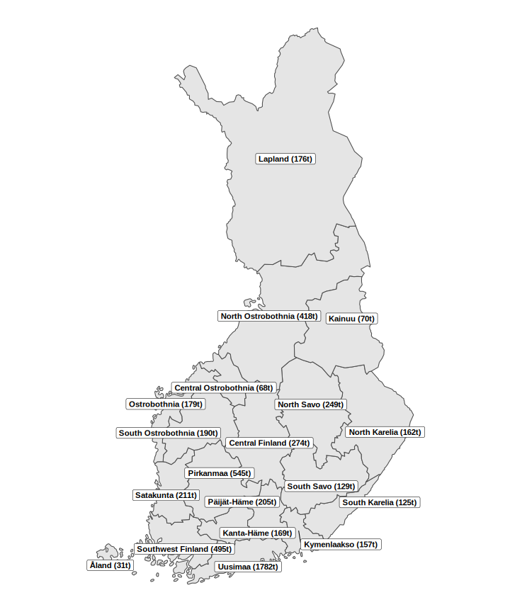
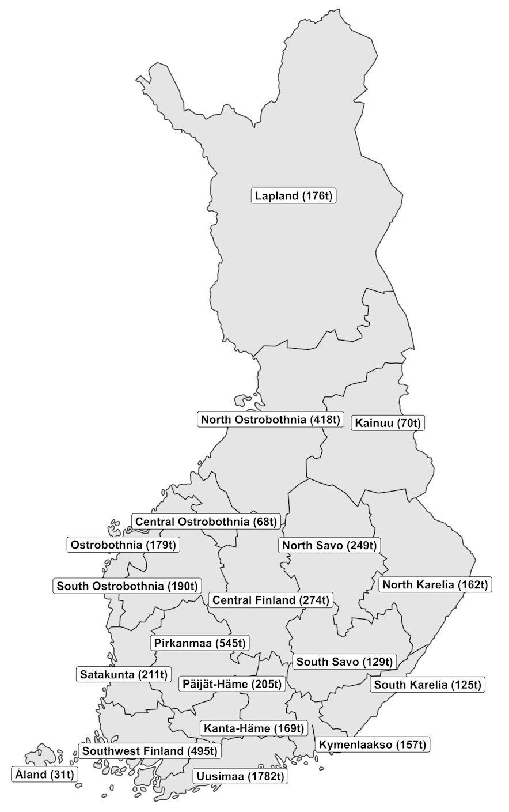
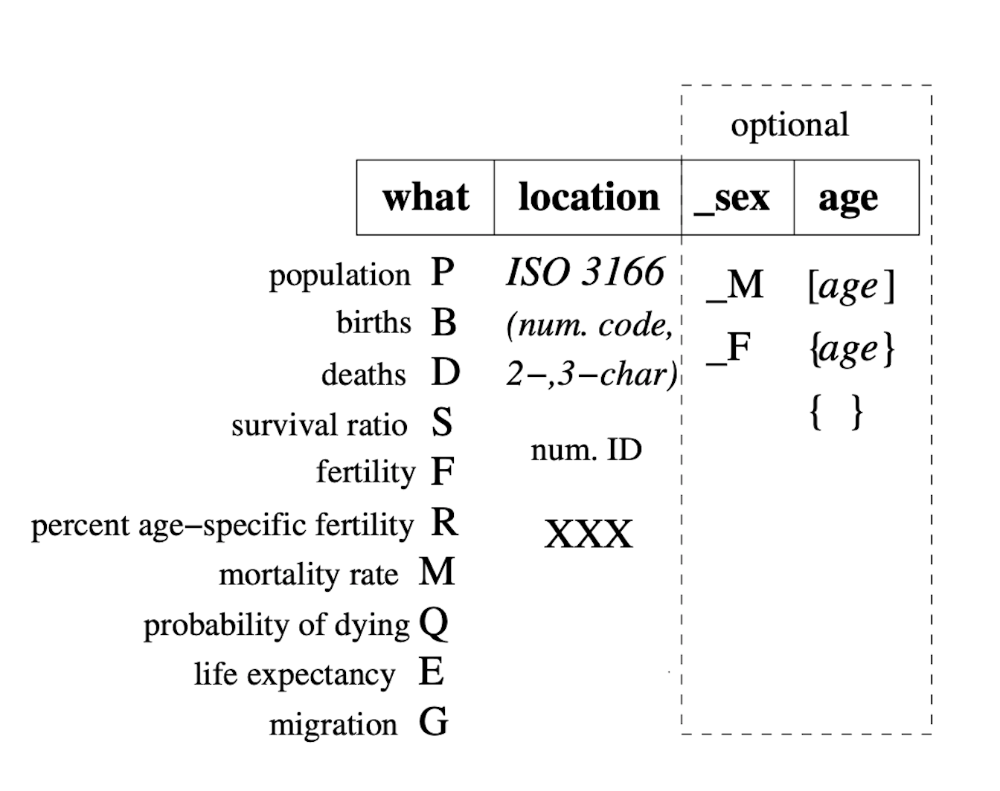

<!-- avoid border around images -->
<style>
    img {
        border: 0;
    }
</style>


```{r, include = FALSE}
knitr::opts_chunk$set(
  collapse = TRUE,
  comment = "#>"
)
download_data <- FALSE
simulate_comp <- FALSE
simulate_pop <- FALSE
```

In this vignette we will show how **bayesPop** can be used in subnational settings, using annual single age (1x1) data. For instructions how to use **bayesPop** to generate national projections, see [Ševčíková and Raftery (2016)](https://www.jstatsoft.org/article/view/v075i05).

We will use example data for 19 subnational (NUTS 2) units in Finland to demonstrate the various functionalities. To briefly contextualise these data, the Finnish regions are responsible for organising health, social, and rescue services in the country (with the exception of the largest region, Uusimaa), making subnational population projections highly relevant for them. The median population is 180 thousand, with a range of 31 thousand to 1.8 million. All regions have seen falling fertility levels (nationally total fertility rate of 1.25 in 2024) and increasing life expectancy at birth (84.8 years for females and 79.7 years for males in 2024). There are substantial regional differences: the eastern regions of the country has lower life expectancy and fertility levels than the western part of the country. The map below shows the geographic location of the regions and its population in 2024.


<!-- The following two commands leave lots of space above and below the map -->
<!--{width=70% align="center"}-->
<!---->

<!-- The following command does not scale it down, even if used with fig.height or out.height -->
<!-- ```{r eval = TRUE, fig.align='center', echo = FALSE}
#
```
-->

<!-- Using a png version of the map -->


To organize our work, let's set up a working directory for all inputs and outputs:

```{r eval = FALSE, include = TRUE}
wrk_dir <- "bayesPopSubnatProj"
```

```{r eval = !download_data, include = FALSE}
wrk_dir <- "ADD YOURS"
wrk_dir <- "~/bayespop/R/Pop/subnat/bayesPopSubnatProj"
```

```{r eval = download_data, include = FALSE}
wrk_dir <- tempdir()
```

# Downloading Data

Next, set a directory to hold the input data and create it if it does not exist:

```{r eval = TRUE, include = TRUE}
data_dir <- file.path(wrk_dir, "inputs")
```

```{r eval = TRUE, include = TRUE}
if(!dir.exists(data_dir)) dir.create(data_dir, recursive = TRUE)
```

## Subnational example data

The subnational data needed to follow examples in this vignette are in the GitHub repository ["PPgp/bayesPopFINdata"](https://github.com/PPgp/bayesPopFINdata) and can be downloaded as follows:

```{r eval = download_data, include = TRUE}
repo_file <- file.path(data_dir, "main.zip")
# The following line should work after the repo is made public.
# Before that, on the GitHub repo click on "Code" -> Download ZIP
# and move main.zip into data_dir. Then continue with the "unzip" line.
download.file("https://github.com/PPgp/bayesPopFINdata/archive/refs/heads/main.zip", repo_file)
unzip(repo_file, exdir = data_dir)
unlink(repo_file)
```

It creates a directory "bayesPopFINdata-main" which contains text files with among others total fertility rates ("tfr.txt"), sex-specific life expectancy at birth ("e0F.txt", "e0M.txt"), net migration rates ("mig_rates.txt"), net migration counts ("mig_counts.txt"), sex- and age-specific population ("popM.txt", "popF.txt"), sex- and age-specific mortality rates ("mxM.txt", "mxF.txt"), and percent age-specific fertility ("pasfr.txt"). The directory also contains the map of the regions shown above.

For the purpose of accessing these dataset, we create an object pointing to this directory:

```{r eval = TRUE, include = TRUE}
data_dir_reg <- file.path(data_dir, "bayesPopFINdata-main")
```

## National projections

To project subnational total fertility rate (TFR) and life expectancy at birth ($e_0$) we will need probabilistic national projections of the corresponding country. Such projections, generated using the **bayesTFR** and **bayesLife** R packages, which align well with the United Nations projections published in the World Population Prospects can be downloaded from [our website](https://bayespop.csss.washington.edu/download) as follows:

```{r eval = download_data, include = TRUE}
options(timeout = 600)
tfr_world_file <- file.path(data_dir, "TFR1simWPP2024.tgz")
download.file("https://bayespop.csss.washington.edu/data/bayesTFR/TFR1simWPP2024.tgz",
              tfr_world_file)
err <- untar(tfr_world_file, exdir = data_dir)
if(err == 0) unlink(tfr_world_file)

e0_world_file <- file.path(data_dir, "e01simWPP2024.tgz")
download.file("https://bayespop.csss.washington.edu/data/bayesLife/e01simWPP2024.tgz",
              e0_world_file)
err <- untar(e0_world_file, exdir = data_dir)
if(err == 0) unlink(e0_world_file)
```

Note that these are big files. Therefore, if you are on a slow network and get a timeout error, you might want to increase the `timeout` option.

# Outline

To generate probabilistic population projections for all Finnish regions, we will proceed in the following steps:

1.  Generate future trajectories of total fertility rates.
2.  Generate future trajectories of life expectancy at birth for female and male.
3.  Generate future trajectories of net migration rates.
4.  Generate future trajectories of age- and sex-specific population.

Results of each of the steps will be stored in its own directory in the parent working directory `wrk_dir`.

We will work with four R packages, namely **bayesTFR**, **bayesLife**, **bayesMig**, and **bayesPop**. Loading **bayesPop** pulls also the first two packages into the namespace. Thus, loading the last two packages will be sufficient.

```{r eval = TRUE, results = FALSE}
library(bayesPop)
library(bayesMig)
```

We will also use the R package **wpp2024** containing datasets from the United Nations World Population Prospects 2024. To install this package, please follow the instructions at [PPgp/wpp2024](https://github.com/PPgp/wpp2024).

Next, we decide on how many trajectories we'd like to generate in each step. The more trajectories, the smoother the results, but the longer the processing time in some cases, especially in step 4. Thus, for steps 1. to 3., we choose 1000 trajectories, while for step 4., to keep the processing time low we will generate only 50 trajectories. Note however, that in a real world simulation one would need to increase it to at least 1000.

```{r}
nr_traj_comp <- 1000
nr_traj_pop <- 50
```

# Total Fertility Rate

The probabilistic projection of subnational TFR is generated using the methodology by [Ševčíková et al. (2018)](https://www.demographic-research.org/volumes/vol38/60/default.htm) and implemented in the **bayesTFR** package. It is based on the idea that TFR in subnational units closely follow the corresponding national projections. Thus, we base our projections on the probabilistic projections for Finland that approximate the United Nations' official projections from the [World Population Prospects 2024](https://population.un.org/wpp) (UN WPP 2024). These projections which we downloaded in the previous step were generated using the methodology and software described in [Liu et al. (2023)](https://doi.org/10.18637/jss.v106.i08).

The directory pointing to these national projections for all countries of the world is

```{r eval = TRUE, include = TRUE}
world_dir_tfr <- file.path(data_dir, "TFR1unc", "sim20241101")
```

One can explore the Finnish projections with various functions from the **bayesTFR** package. For example as a graph:

```{r eval = TRUE, include = TRUE, fig.width = 7, fig.height = 5, fig.align='center', border = "0"}
tfr_world_pred <- get.tfr.prediction(world_dir_tfr)
tfr.trajectories.plot(tfr_world_pred, country = "FIN", nr.traj = 50, half.child.variant = FALSE,
                      uncertainty = TRUE)

```

Here, for the `country` argument the ISO-3 code is used. An ISO-2 or a numerical UN code (which is 246 for Finland) is also accepted. In addition to the predictive distribution (shown as grey trajectories) with its probability intervals (shown as red lines), the graph also shows uncertainty around the observed data (controlled by the argument `uncertainty`), which is in the case of Finland very narrow. Numerical values from this graph can be seen using the function `tfr.trajectories.table()`. For more information on how to explore such national projections see [Liu et al. (2023)](https://doi.org/10.18637/jss.v106.i08).

To generate subnational projections for the Finnish regions, we will use observed TFR data in "tfr.txt" that we downloaded above.

```{r eval=TRUE, include=TRUE}
tfr_subnat_file <- file.path(data_dir_reg, "tfr.txt")
read.table(tfr_subnat_file, sep= "\t", header = TRUE, check.names = FALSE) |> head()
```

It contains TFR for 19 Finnish regions, from 1990 to 2024. A unique identifier of the regions is given by the column "reg_code". The column "country_code" defines the corresponding country, here 246 for Finland. The column "include_code" specifies if the region should be included in the prediction (value 2) or not (value 0). Here, the last entry of the dataset corresponds to the national values and therefore has "include_code" of 0. Note that the data can contain missing values at the beginning or/and the end of the time series. In our case, no missing values are present.

The subnational TFR predictions will be stored in the sub-directory "tfr" of our working directory:

```{r eval=TRUE, include=TRUE}
dir_tfr <- file.path(wrk_dir, "tfr")
```

The chosen number of trajectories (`r nr_traj_comp`) is the same as in the national simulation, obtained via `summary(tfr_world_pred)`, which is the upper bound for this choice.

To launch the predictions, we use the function `tfr.predict.subnat()`:

```{r eval=simulate_comp, include=TRUE, results = FALSE}
tfr_pred <- tfr.predict.subnat(countries = 246, sim.dir = world_dir_tfr, output.dir = dir_tfr,
                               annual = TRUE, start.year = 2025, end.year = 2050, 
                               nr.traj = nr_traj_comp, my.tfr.file = tfr_subnat_file,
                               verbose = TRUE
                               )
```

Here, we are directing the function to generate `r nr_traj_comp` trajectories of future annual TFR from 2025 until 2050 for regions found in the file given by argument `my.tfr.file`, that is, for regions that belong to country 246 (i.e. Finland). Argument `annual` determines that the function expects annual subnational data, as oppose to 5-year data. Argument `sim.dir` points to the national projections, while argument `output.dir` determines where the results are to be stored.

Since the `tfr.predict.subnat()` function allows to run predictions for multiple countries at once (given by the vector `countries`), the return value is a list with names corresponding to the country codes. Thus, to extract the list item for Finland, we do:

```{r eval=simulate_comp}
tfr_pred_reg <- tfr_pred[["246"]]
```

Alternatively, if the predictions are accessed at a later time point, one can obtain the same object by pointing to the simulation directory:

```{r eval=!simulate_comp}
tfr_pred_reg <- get.regtfr.prediction(dir_tfr, country = 246)
```

Now various **bayesTFR** functions for analyzing results can be used. For example, to view the projected TFR for two different regions (here historically high and low fertility regions Central Ostrobothnia and Kymenlaakso, respectively), do:

```{r eval=TRUE, include=TRUE, fig.width = 7, fig.height = 4, fig.align='center'}
par(mfrow = c(1,2))
for (loc in c("Central Ostrobothnia", "Kymenlaakso")){
  tfr.trajectories.plot(tfr_pred_reg, loc, half.child = FALSE, nr.traj = 50, pi = 95, ylim = c(0.5,2.5))
  abline(h = 2.1, col = "grey")
}
```

In each graph, we have also drawn a grey horizontal line at the replacement level of 2.1. One can see that while Kymenlaakso have almost zero probability that TFR will reach the replacement level before 2050, for Central Ostrobothnia there is a somewhat larger chance that TFR will get to or even above the replacement level.

Tabular results can be viewed using either the `summary()` function which returns among others the mean and standard deviation, or the `tfr.trajectories.table()` function which can return any quantile of interest of the given location:

```{r}
tfr.trajectories.table(tfr_pred_reg, "Lapland") |> tail()
```

One can extract all trajectories as a matrix, for example to be used as an input to downstream models, or to compute probabilities of events of interest:

```{r}
trajs <- get.tfr.trajectories(tfr_pred_reg, "Central Ostrobothnia")
dim(trajs)
```

The dimensions of the resulting matrix correspond to the number of time points (`r nrow(trajs)`) x number of trajectories (`r nr_traj_comp`).

To quantify our statement above, we now compute the probability that the TFR in Central Ostrobothnia will be above the replacement level by 2050. One can approximate that by computing the frequency of the event happening among the available trajectories:

```{r}
sum(trajs["2050", ] > 2.1) / ncol(trajs) * 100
```

Note that since the **bayesTFR** package was originally designed to work on the national level, many functions accept the argument `country` or have "country/ies" in its name. When using in the subnational context, a "country" means a region. For example, to view all regions included in the projection, including their codes, one can use:

```{r}
get.countries.table(tfr_pred_reg) |> head()
```

Or, to obtain the code or index of a specific region:

```{r}
get.country.object("Kainuu", country.table = get.countries.table(tfr_pred_reg))
```

Similarly, searching by code or index:

```{r results = FALSE}
get.country.object(21, country.table = get.countries.table(tfr_pred_reg))
get.country.object(19, country.table = get.countries.table(tfr_pred_reg), index = TRUE)
```

The working directory now should contain a sub-directory "tfr" that contains a directory "subnat/c246" which holds the prediction info and TFR trajectories for each region.

# Life Expectancy at Birth

The probabilistic projections of subnational life expectancy at birth ($e_0$) is generated using the methodology of [Ševčíková and Raftery (2021)](https://sciendo.com/article/10.2478/jos-2021-0027) which is implemented in the **bayesLife** package. Similarly to modeling subnational fertility, $e_0$ in subnational units can be also modeled by following closely the national projections, in our case the probabilistic projections of the Finnish $e_0$ which we generated to approximate the [UN WPP 2024](https://population.un.org/wpp) and which we downloaded previously. They were produced using the methodology of [Raftery et al. (2013)](http://link.springer.com/content/pdf/10.1007%2Fs13524-012-0193-x.pdf).

As in the national case, we first project female $e_0$. Then the male $e_0$ is projected using the gap model as described in [Raftery et al. (2014)](http://www.demographic-research.org/volumes/vol30/27/30-27.pdf).

The directory pointing to the national $e_0$ projections for all countries is

```{r eval = TRUE, include = TRUE}
world_dir_e0 <- file.path(data_dir, "e01", "sim20241101")
```

To explore the Finnish projections one can use various functions from the **bayesLife** package. For example:

```{r eval = TRUE, include = TRUE, fig.width = 7, fig.height = 5, fig.align='center'}
par(mfrow = c(1,1))
e0_world_pred <- get.e0.prediction(world_dir_e0)
e0.trajectories.plot(e0_world_pred, country = "FIN", nr.traj = 50, both.sexes = TRUE)
```

For subnational observed data we will use the two files we downloaded earlier, one for female and one for male.

```{r eval=TRUE, include=TRUE}
e0F_subnat_file <- file.path(data_dir_reg, "e0F.txt")
e0M_subnat_file <- file.path(data_dir_reg, "e0M.txt")
read.table(e0F_subnat_file, sep= "\t", header = TRUE, check.names = FALSE) |> head()
```

For each region, the files contain $e_0$ from 1992 through 2024. The meaning of the remaining columns (`reg_code`, `country_code`, `include_code`) is the same as in the case of TFR.

We set the directory for storing the subnational prediction of $e_0$ to "e0", located inside the main working directory:

```{r eval=TRUE, include=TRUE}
dir_e0 <- file.path(wrk_dir, "e0")
```

Now we can launch the $e_0$ predictions:

```{r eval=simulate_comp, include=TRUE, results = FALSE}
e0_pred <- e0.predict.subnat(countries = 246, sim.dir= world_dir_e0, output.dir = dir_e0,
                             annual = TRUE, start.year = 2025, end.year = 2050, 
                             nr.traj = nr_traj_comp, my.e0.file = e0F_subnat_file, 
                             predict.jmale = TRUE, my.e0M.file = e0M_subnat_file
                             )
```

Here, we are generating `r nr_traj_comp` trajectories of annual future $e_0$ from 2025 until 2050 using data found in the file given by the `my.e0.file` argument, which in our case is female $e_0$. However, setting the argument `predict.jmale` to `TRUE`, we are directing the function to also predict male $e_0$ by applying the female-male gap model using the male $e_0$ found in the file given by the `my.e0M.file` argument.

As in the TFR case, the resulting object from the above call is a list and we can extract the Finnish results by

```{r eval=simulate_comp}
e0_pred_reg <- e0_pred[["246"]]
```

Or, if the predictions are accessed at a later time point:

```{r eval=!simulate_comp}
e0_pred_reg <- get.rege0.prediction(dir_e0, country = 246)
```

For analyzing results, various **bayesLife** functions can be used. Here for two regions, we view the projected marginal $e_0$ for both sexes, using the national female projections as a background (grey lines) for a comparison:

```{r eval=TRUE, include=TRUE, fig.width = 7, fig.height = 4, fig.align='center'}
par(mfrow = c(1,2))
for (loc in c("Åland", "Lapland")){
  # plot the national female projections in grey
  e0.trajectories.plot(e0_world_pred, country = "FIN", nr.traj = 0, 
                       xlim = c(1970, 2050), ylim = c(70, 93), pi = 80, 
                       show.legend = FALSE, main = loc, col = rep("grey", 4))
  # add sub-national projections
  e0.trajectories.plot(e0_pred_reg, loc, nr.traj = 0, pi = 80, 
                       both.sexes = TRUE, add = TRUE, show.legend = FALSE)
  legend("topleft", legend = c("female", "male", "FIN female", "median", "80% PI"),
         bty = "n", col = c("pink", "darkgreen", "grey", "black", "black"),
                    lty = c(1, 1, 1, 1, 2), lwd = 2, cex = 0.7)
}
```

This marginal distribution may suggest that crossovers between female and male $e_0$ are possible. However, when viewing the joint distribution between male and female $e_0$, here for three different years, it is obvious that it is not the case:

```{r eval=TRUE, include=TRUE, fig.width = 7, fig.height = 4, fig.align='center'}
par(mfrow = c(1,2))
for (loc in c("Åland", "Lapland"))
  e0.joint.plot(e0_pred_reg, loc, years = c(2025, 2035, 2050), 
                xlim = c(75, 95), ylim = c(75, 95))
```

The minimum and maximum gap between female and male $e_0$ is controlled via an optional argument `gap.lim` that can be passed to the `e0.predict.subnat()` function. Its default value is `c(0, 18)`, meaning that the difference cannot be negative and cannot be larger than 18 years. However, if one would replace it for example with `c(-2, 18)`, trajectories where male $e_0$ is larger than female $e_0$ by up to 2 years would be allowed. By default, values outside of the `gap.lim` range are re-sampled.

Functions `e0.trajectories.table()` and `summary()` can be used to explore tabular results. When passing the `e0_pred_reg` object to them, the operation is performed on the female prediction object. To retrieve the male prediction object, do:

```{r eval=TRUE}
e0M_pred_reg <- get.e0.jmale.prediction(e0_pred_reg)
```

To retrieve the values of all male trajectories, for example for Lapland, do

```{r eval=TRUE}
trajLapland <- get.e0.trajectories(e0M_pred_reg, "Lapland")
```

It is an array of time x trajectories. These can be used to create other summaries, or for computing various probabilities. For example, what is the probability that Lapland male $e_0$ by 2050 reaches the 2024 national value of 79.4?

```{r eval=TRUE}
sum(trajLapland["2050", ] >= 79.4)/ncol(trajLapland) * 100
```

Note that the 2024 male national $e_0$ was retrieved via

```{r eval=TRUE}
e0M_world_pred <- get.e0.jmale.prediction(e0_world_pred)
e0.trajectories.table(e0M_world_pred, "FIN")["2024", "median"]
```

# Migration

In this third step, we will generate probabilistic projection of net migration rates (NMR) for all regions, using the **bayesMig** package. First, we will use our example historical data (downloaded above) to estimate the Bayesian hierarchical (BHM) model by [Azose and Raftery (2015)](http://link.springer.com/article/10.1007/s13524-015-0415-0).

The units in our historical estimates are the number of migrants per population. Here are the first few lines in that dataset:

```{r eval=TRUE}
mig_subnat_file <- file.path(data_dir_reg, "mig_rates.txt")
mig_data <- read.table(mig_subnat_file, sep= "\t", header = TRUE, check.names = FALSE)
tail(mig_data)
```

The methodology and the **bayesMig** package itself have been designed for a model hierarchy of countries -\> world. However, we found that the model also works well when applied to sub-national units, in our case using the hierarchy regions -\> Finland. Thus, when using within **bayesMig** we are pretending that the Finnish regions are countries and call the unique identifier `country_code`. The `include_code` column specifies if the corresponding location should be included in the BHM and its data should influence the global parameters (value 2), or if only location-specific parameters will be estimated using the global experience without back-influencing it (value 1), or not be included at all (value 0). The second case (value 1) is to be used for locations with unusual patterns, or simply for very small locations without a representative historical experience. In our dataset we set `include_code` to 2 for all regions and 0 for the national data. In our dataset we don't have locations with small population and thus, we don't have records with value 1.

```{r eval=TRUE}
subset(mig_data, include_code != 2)[, 1:3]
```

To estimate the model to derive region-level parameters, we will run Markov Chain Monte Carlo (MCMC) for which we set the number of iterations per chain, the thinning interval and the number of chains:

```{r eval=TRUE}
mig_iter <- 3000
mig_thin <- 3
mig_nr_chains <- 2
```

Normally in a real-world example, about 3 x 50,000 iterations would be needed. For our toy example, we will only iterate `r mig_nr_chains` x `r mig_iter` times and keep every `r mig_thin`rd iteration. The simulation results will be stored in the sub-directory "mig" of our working directory:

```{r eval=TRUE, include=TRUE}
dir_mig <- file.path(wrk_dir, "mig")
```

```{r eval=simulate_comp, include = FALSE}
if(dir.exists(dir_mig)) unlink(dir_mig, recursive = TRUE)
```

To launch the MCMCs with these settings, we use the function `run.mig.mcmc()` as follows:

```{r eval=simulate_comp, results = FALSE}
mig_mcmc <- run.mig.mcmc(nr.chains = mig_nr_chains, iter = mig_iter, 
                         thin = mig_thin, output.dir = dir_mig, 
                         my.mig.file = mig_subnat_file,
                         annual = TRUE, present.year = 2024,
                         verbose.iter = 500, replace.output = TRUE)
```

The function also accepts an optional argument `exclude.from.world`. This can be used in addition to the `include_code` column to explicitly specify additional locations to be excluded from influencing the global parameters. The function `get.countries.table(mig_mcmc)` can help to see the location codes. Locations excluded from influencing the global parameters would be sorted at the end of that list. In [Yu et al. (2023)](https://doi.org/10.1215/00703370-10772782) which generates population projections for all counties in the Washington State, all counties below population of 25,000 were passed to the `exclude.from.world` argument.

An optional argument `start.year` could be used to limit the time span of the observed data used for the estimation. Here we use all available data from 1990 to 2024.

Now various **bayesMig** functions can be used to explore the results of the estimation. For example, `mig.partraces.plot(mig_mcmc, burnin = 1000)` for plotting the traces of global parameters, or `mig.partraces.cs.plot` for traces of the state-specific parameters. See `?bayesMig` for more info.

We will now use the MCMC results which are stored in `dir_mig` to generate future trajectories of NMR for each region from 2025 to 2050:

```{r eval=simulate_comp, results = FALSE}
mig_pred <- mig.predict(sim.dir = dir_mig, end.year = 2050, 
                        nr.traj = nr_traj_comp, burnin = 1000,
                        save.as.ascii = nr_traj_pop)
```

We are using the same number of trajectories as for TFR and $e_0$, namely `r nr_traj_comp` while discarding first 1000 iterations from each chain as burnin. Note that after applying the burnin, our toy MCMCs will contain `r mig_nr_chains` x (`r mig_iter` - 1000) = `r mig_nr_chains*(mig_iter - 1000)` iterations. These will be then collapsed and thinned by `r mig_nr_chains*(mig_iter - 1000)/nr_traj_comp` to yield `r nr_traj_comp` trajectories. In a real-world simulation with 3 x 50,000 iterations, we would recommend to use about 20,000 burnin.

The last option, `save.as.ascii`, causes that the projection directory "{dir_mig}/predictions" contains a file called "ascii_trajectories.csv" which will be used as input to the population projection in the next section.

To retrieve the MCMC object and the prediction from disk, for example at later time, one can use:

```{r eval=!simulate_comp}
mig_mcmc <- get.mig.mcmc(dir_mig)
mig_pred <- get.mig.prediction(dir_mig)
```

As in the case of TFR and $e_0$, various functions can be used to analyze the prediction, for example as plots:

```{r eval=TRUE, fig.width = 6, fig.height = 4.5, fig.align='center'}
par(mfrow = c(1,1))
mig.trajectories.plot(mig_pred, "Kanta-Häme", nr.traj = 20)
abline(h = 0, col = "grey")
```

One can see that for Kanta-Häme, the NMR is projected likely to be positive, which is in line with the historical experience. However, the results of this toy example do not exclude the possibility of having negative net migration in this region, which was also observed in the past.

# Population

## Inputs

The inputs for probabilistic population projections consist of the three **probabilistic components** we just generated, namely future

-   TFR
-   male and female $e_0$
-   net migration

Let's create objects that will serve as pointers to these inputs. First, pointing to the simulation directories with subnational TFR and $e_0$:

```{r eval=TRUE}
dir_tfr_reg <- file.path(dir_tfr, "subnat/c246")
dir_e0_reg <- file.path(dir_e0, "subnat_ar1/c246")
```

Second, for migration we point to the ASCII file of trajectories generated during the migration prediction above:

```{r eval=TRUE}
file_mig_traj <- file.path(dir_mig, "predictions/ascii_trajectories.csv")
```

In addition to the probabilistic inputs, the following **deterministic datasets** are needed, most of which we downloaded in the first section:

-   Initial population estimates by sex and age (files "popM.txt" and "popF.txt").
    -   Only population at the present time is required, but longer series are helpful for viewing trends of various output indicators.
-   Historical estimates of sex- and age-specific mortality rates (files "mxM.txt" and "mxF.txt").
    -   These are needed to estimate Lee-Carter parameters in order to match future mortality rates to future $e_0$.
-   Historical estimates of percent age-specific fertility (file "pasfr.txt").
    -   Should include ages from 10 to 54.
-   Historical migration counts (files "migrationM.txt", "migrationF.txt").
    -   Can be given as totals, totals by sex, or age- or sex-specific counts. We use the latter, namely age-specific female counts ("migrationF.txt") and age-specific male counts ("migrationM.txt"). If only totals are provided, they are distributed into ages via one of the methods given in the arguments. These datasets are only used for viewing trends. They do not influence projected migration.
-   Historical estimates of sex-ratio at birth.
    -   An optional dataset. We will use the national values for all regions.
-   Dataset of locations (file "locations.txt").
    -   Regions with "location_type" of 4 will be processed, while the rest will be ignored. The last entry (Finland) is needed for aggregations.

In all of these deterministic input datasets, the region-specific ID column is called "reg_code".

Before launching the population predictions, we set the location for storing the results. It will be sub-directory "pop" of our working directory:

```{r eval=TRUE}
dir_pop <- file.path(wrk_dir, "pop")
```

```{r eval=simulate_pop, include = FALSE}
if(dir.exists(dir_pop)) unlink(dir_pop, recursive = TRUE)
```

In addition, we create a pointer to the location file containing codes for all regions:

```{r eval=TRUE}
file_locs <- file.path(data_dir_reg, "locations.txt")
```

## Generating Population Projections

Now we generate future population sex- and age-specific trajectories for all regions of Finland:

```{r eval=simulate_pop, include=TRUE, results = FALSE}
pop_pred <- pop.predict.subnat(output.dir = dir_pop, 
                locations = file_locs, default.country = 246, 
                annual = TRUE, wpp.year = 2024, 
                present.year = 2024, end.year = 2050,
                nr.traj = nr_traj_pop, verbose = TRUE, 
                inputs = list(
                    popM = file.path(data_dir_reg, "popM.txt"),
                    popF = file.path(data_dir_reg, "popF.txt"),
                    mxM = file.path(data_dir_reg, "mxM.txt"), 
                    mxF = file.path(data_dir_reg, "mxF.txt"),
                    pasfr = file.path(data_dir_reg, "pasfr.txt"),
                    migM = file.path(data_dir_reg, "migrationM.txt"),
                    migF = file.path(data_dir_reg, "migrationF.txt"),
                    migtraj = file_mig_traj,
                    tfr.sim.dir = dir_tfr_reg,
                    e0F.sim.dir = dir_e0_reg,
                    e0M.sim.dir = "joint_"
                  ),
                  mig.age.method = "rc", mig.is.rate = c(FALSE, TRUE), 
                  keep.vital.events = TRUE, pasfr.ignore.phase2 = TRUE, replace=TRUE
            )
```

The `default.country` argument determines the country to which the regions belong to, as it is used for extracting default datasets in case some input datasets are missing. Such datasets would be pulled from a **wpp** package given by the `wpp.year` argument. In our example, since there is no entry for the dataset of sex-ratio at birth, it is taken from the values for Finland in the **wpp2024** package.

The `annual` argument determines that this is a 1x1 simulation. If it is `FALSE`, it is assumed that the simulation is 5x5. In such a case however, all input datasets, including the probabilistic inputs, must be on a 5x5 scale.

By default total migration is distributed into ages using a basic Rogers-Castro function (argument `mig.age.method`). An alternative method is implemented in **bayesPop**, the Flow Difference Method (Ševčíková, Raymer and Raftery, 2024), which might be more suitable for subnational units that experience a different pattern than Rogers-Castro, for example, regions with high migration of retirees.

The given method is used for both, historical migration and projected migration, if these datasets are not provided by age. In our case, we have provided historical data by age (via the elements `migM` and `migF`), therefore no age-splitting is applied to historical data. However, if we would have passed total counts of historical migration, e.g. `mig = file.path(data_dir_reg, "mig_counts.txt")` instead of providing `migM` and `migF`, the method given in the argument `mig.age.method` would be applied. 

In addition to historical time periods, the datasets given in `migM`, `migF` or `mig` can contain future time periods as well. In such a case, and if the component `migtraj` is not given, future migration is considered to be deterministic.

The two elements in the argument `mig.is.rate` determine that 1. the observed migration data are on the scale of counts (`FALSE`), and 2. the predicted migration trajectories are on the scale of rates (`TRUE`).

If `keep.vital.events` is set to `FALSE`, only population results are stored and thus, can save significant amount of space on the hard drive. However, if you want to have an access to other indicators than population, such as the projected number of births and deaths, set this argument to `TRUE`.

If the current total fertility rate of all regions already passed the fertility transition, set the argument `pasfr.ignore.phase2` to `TRUE` as in this example. It has an impact on predicting the future fertility age distribution.

Note that this is a toy simulation where the number of trajectories (`nr.traj`) is set to a small number, here `r nr_traj_pop`. Normally we would want to generate 1000 or more trajectories.

Now we will aggregate over all regions.

```{r eval=simulate_pop, include=TRUE, results = FALSE}
pop_aggr <- pop.aggregate.subnat(pop_pred, regions = 246, locations = file_locs)
```

To access the projection and aggregation objects from disk, e.g. at a later time point, one would do

```{r eval=!simulate_pop}
pop_pred <- get.pop.prediction(dir_pop)
pop_aggr <- get.pop.aggregation(sim.dir = dir_pop)
```

## Results

The function `get.countries.table()` work with both, the `pop_pred` and `pop_aggr` objects:

```{r, eval = TRUE}
get.countries.table(pop_pred) |> tail()

get.countries.table(pop_aggr)
```

Projection results can be viewed either as a function of time, as a function of age, as well as by individual cohorts. These will be described below. See Ševčíková & Raftery (2016) for more detailed explanations and more examples.

### Projections by time

One can plot population projections by time for individual regions or for the aggregated geography (here the country):

```{r eval = TRUE, fig.width = 6, fig.height = 4.5, fig.align='center'}
pop.trajectories.plot(pop_pred, "Kanta-Häme", nr.traj = 20)
```

```{r eval = TRUE, fig.width = 6, fig.height = 4.5, fig.align='center'}
pop.trajectories.plot(pop_aggr, 246, nr.traj = 20)
```

Tabular results can be viewed for example via

```{r, eval = TRUE}
pop.trajectories.table(pop_pred, "Satakunta") |> tail()
```

Both functions accept an argument `pi` specifying the probability intervals to be viewed. To generate projections plots for all regions at once, use the function `pop.trajectories.plotAll()`.

### Projections by age

To view projections as a function of age, one would use the function `pop.byage.plot()`. Here is an example of comparing the projected age structure for 2050 with the observed age structure in 2024 for UUsimaa:

```{r eval = TRUE, fig.width = 6, fig.height = 4.5, fig.align='center'}
pop.byage.plot(pop_pred, "Uusimaa", year = 2050, nr.traj = 20)
pop.byage.plot(pop_pred, "Uusimaa", year = 2024, add = TRUE, 
               col = "blue", show.legend = FALSE)
```

To view these results as a table, do

```{r, eval = TRUE}
pop.byage.table(pop_pred, "Uusimaa", year = 2050) |> head()
```

Here too, one can use the argument `pi` to specify probability intervals, and use `pop.byage.plotAll()` to plot all regions at once.

Functions to view probabilistic population pyramids are available. Here for example, comparing two years on proportional scale.

```{r eval = TRUE, fig.width = 6, fig.height = 4.5, fig.align='center'}
pop.pyramid(pop_pred, "Kainuu", year = c(2050, 2024), proportion = TRUE)
```

### Cohort projections

One can view population projections for specific cohorts. For example, the following call will show projections of population born in ten different years:

```{r eval = TRUE, fig.width = 7, fig.height = 4.5, fig.align='center'}
pop.cohorts.plot(pop_pred, "Kainuu", 
                 cohorts = seq(2000, 2045, by = 5))
```

The underlying data can be extracted via the function `cohorts()`.

### Using expressions to retrieve other indicators

To retrieve other quantities of interest, **bayesPop** offers a simple expression language. An expression is a collection of basic components connected by arithmetic operations. A basic component has four parts, two of which are optional. They are summarized in the following figure.



A basic component starts with a letter that defines what kind of indicator it is (e.g. "G" for net migration), which is followed by an indication of a location. In a national context, one could use 2- or 3-character ISO3166 codes or numerical codes. In the subnational context, these should be numerical identifiers only. Another option is to use "XXX", which is a wildcard for all locations. In our example, "G19" means net migration for Lapland. The location identifier can be followed by either "\_M" or "\_F", specifying male or female, respectively. Finally, a basic component can be concluded by a definition of age, enclosed either in square brackets or curly braces. In an 1x1 simulation, age is given by the actual age values, starting with 0. In a 5x5 simulation it should be an index, as explained in Ševčíková & Raftery (2016). Square brackets trigger a summation of the given ages, while curly braces keep the ages disaggregated. If the age definition is not used, the default behaviour is summing over all ages. If curly braces do not contain any age specification, i.e. they are left empty, it is the same as all ages would be given.

Basic components can be connected by arithmetic operations. Here are some example of expressions that could be used in our simulation:

-   "P1": Total population of Uusimaa
-   "P6_F / P6_M": Sex ratio of Pirkanmaa
-   "P18[20:64] / P18[65:130]": Potential support ratio in Kainuu (ratio of 20-64 years old to 65+)
-   "B19 / D19": Births to deaths ratio in Lapland
-   "log(MFIN_M{})": log of male age-specific mortality rates for Finland

Additional pre-defined functions are available, for example for computing group means and medians, or for the mean age of childbearing. See `?pop.expressions` for more detail.

#### Visualizing expression results

Various functions in the package accept these expressions via the argument `expression`. They can be used to view projection trajectories by time using functions `pop.trajectories.plot()` and `pop.trajectories.table()`, as well as trajectories by age using functions `plot.byage.plot()` and `pop.byage.table()`.

For example, to view the potential support ratio for Uusimaa, one can use

```{r eval = TRUE, fig.width = 6, fig.height = 4.5, fig.align='center'}
pop.trajectories.plot(pop_pred, expression = "P1[20:64] / P1[65:130]", 
                      nr.traj = 20,
                      main = "Potential Support Ratio for Uusimaa")

```

Or quantities by combining areas, here the population in Eastern vs. Western Finland:

```{r eval = TRUE, fig.width = 7, fig.height = 4, fig.align='center'}
par(mfrow = c(1,2))

pop.trajectories.plot(pop_pred, expression = "P10+P11+P12", 
                      nr.traj = 20,
                      main = "Eastern Finland")
pop.trajectories.plot(pop_pred, expression = "P2+P4+P6+P13+P14+P15+P16", 
                      nr.traj = 20,
                      main = "Western Finland")

```

Or quantities by age, here log of female probability of dying in Southwest Finland in 2050:

```{r eval = TRUE, fig.width = 6, fig.height = 4.5, fig.align='center'}
par(mfrow = c(1,1))

pop.byage.plot(pop_pred, expression = "log(Q2_F{})", nr.traj = 20, year = 2050,
               main = "2050 Female prob. of dying in Southwest Finland")
```

Similarly, one can use expressions for aggregated locations. Here, we'll show a few examples when using pre-defined functions. These can be used to apply expressions to the various dimensions of the basic components. For example, to compute the median age of women in childbearing ages, one would use the `pop.apply` function which applies the given function (here group median) to the age dimension. When applied to our aggregated object, one can use the ISO3166 character code for Finland as follows:

```{r eval = TRUE, fig.width = 6, fig.height = 4.5, fig.align='center'}
expr <- "pop.apply(PFIN_F{10:54}, gmedian, cat = 10:55)"
pop.trajectories.plot(pop_aggr, nr.traj = 20, expression = expr, 
                      main = "Median age of women in childbearing ages (Finland)")
```

The `cat` argument to be passed to the `gmedian` function defines the brackets of the age categories. Note that in an 1x1 simulation, childbearing ages are 10-54, while in a 5x5 simulation it is 15-49. Similarly, the average age in Finland could be expressed as "pop.apply(PFIN{}, gmean, cat = 0:131)", or equivalently as "pop.apply(age.func1(PFIN{}), fun = sum) / PFIN".

Regarding the latter expression, the `age.func1()` by default multiplies the middle of each age category with the result of its first argument. The `pop.apply()` function then sums along the age dimension.

An example of an indicator by age for Finland is age-specific fertility rate, here for two different years:

```{r eval = TRUE, fig.width = 6, fig.height = 4.5, fig.align='center'}
expr <- "F246_F{10:54}"
pop.byage.plot(pop_aggr, nr.traj = 20, expression = expr, year = 2050,
               main = "Age-specific fertility (Finland)")
pop.byage.plot(pop_aggr, expression = expr, year = 2024, add = TRUE, 
               col = "blue", show.legend = FALSE)
legend("topright", legend = c(2050, 2024), col = c("red", "blue"), 
       lty = 1, bty = "n")
```

Note that expression "F246", i.e. fertility summed over ages, is the total fertility rate of Finland. For mean age of childbearing in an 1x1 simulation, one could use the expression-generating function `mac.expression1(code)` where code is the unique identifier of the location, and pass it to a function that returns results by time, e.g. `pop.trajectories.plot()`.

The cohort functions also accept expressions. For example, showing births to mothers of three different cohorts in `r subset(get.countries.table(pop_pred), code == 17)$name` (code 17), one could do:

```{r eval = TRUE, fig.width = 7, fig.height = 2.5, fig.align='center'}
pop.cohorts.plot(pop_pred, expression = "B17{}", cohorts = c(1990, 2010, 2030))
```

Note that when passing an expression the cohort functions, it has to contain curly braces ("{}").

#### Extracting expressions results

The values of a basic component can be extracted via the `get.pop()` function, which returns a four dimensional array of locations x ages x time x trajectories. The location dimension in most cases will be one, as a location must be specified when using this function. In an 1x1 simulation, fertility related indicators (F, R, B) have an age dimension 45 (ages from 10 to 54), while all other indicators have a dimension 101 for observed data and 131 for projected data. However, if the basic component is defined as a summation over ages, the age dimension is one. The time dimension depends if we are extracting projected data or observed data, which is controlled by the argument `observed`. The trajectories dimension will be one on observed data, while for projected data it corresponds to the number of trajectories in the prediction object.

Given that in our toy simulation, we have `r length(pop_pred$proj.years)` projected time points (including the present year), `r ncol(pop_pred$inputs$pop.matrix[[1]])` time points of historical population data, and `r nr_traj_pop` trajectories, observe the dimensions of the arrays resulting from the following basic components:

```{r eval = TRUE}
get.pop("P13{}", pop_pred) |> dim()
get.pop("P13{}", pop_pred, observed = TRUE) |> dim()
get.pop("P19", pop_pred) |> dim()
get.pop("P19", pop_pred, observed = TRUE) |> dim()
get.pop("D1_M[0:10]", pop_pred) |> dim()
get.pop("D1_M{0:10}", pop_pred) |> dim()
get.pop("B19{}", pop_pred) |> dim()
get.pop("F2{}", pop_pred, observed = TRUE) |> dim()
```

Knowing the resulting dimensions is important when combining different basic components into one expression, as any combined arrays should have the same dimensions. However, the pre-defined function `pop.combine()` can help if it's not the case, see `?pop.expressions` for more detail.

There are two convenience functions that can handle more complex expressions, as well as can drop unnecessary dimensions. These are `get.pop.ex()` for retrieving expression results by time, and `get.pop.exba()` for retrieving results by age. These two functions can also handle retrieving data for all locations at once and thus, they allow to use the wildcard "XXX".

For example, to retrieve data on the percent of total population in `r subset(get.countries.table(pop_pred), code == 1)$name` (code 1) within the country, one would use the `get.pop.ex()` function which drops the location and age dimension:

```{r eval = TRUE}
get.pop.ex("P1 / P246 * 100", pop_pred) |> dim()
```

Applying the same computation to all locations at once, the location dimension is retained:

```{r eval = TRUE}
get.pop.ex("PXXX / P246 * 100", pop_pred) |> dim()
```

In such a case, the order of the locations along the first dimension is the same as in the table returned by `get.countries.table(pop_pred)`.

Note that the above mentioned expressions that use the pre-defined function `pop.apply()` that performs operations along the age dimension, e.g. mean age, could be passed to the `get.pop.ex()` function, as they result in an indicator by time.

To extract values by age, e.g. the sex ratio in `r subset(get.countries.table(pop_pred), code == 21)$name` (code 21), the `get.pop.exba()` function retains the age dimension:

```{r eval = TRUE}
get.pop.exba("P21_M{} / P21_F{}", pop_pred) |> dim()
```

Both functions also accepts the logical argument `observed` to indicate if the values should be for the past or future time periods. In addition, a logical argument `as.dt` can be used to return the results as a `data.table` format, instead of an array. E.g.,

```{r eval = TRUE}
get.pop.exba("PXXX_M{} / PXXX_F{}", pop_pred, observed = TRUE, 
             as.dt = TRUE) |> head()
```

Trajectories may be useful to combine, explore, and use in downstream analyses, for example, in prevalence-based projections of older adults’ residential care needs. Trajectories of population components may also be combined to  understand the sources of uncertainty. Below, we scatter the uncertainty in the support ratio in `r subset(get.countries.table(pop_pred), code == 18)$name` (code 18) in 2050 against the uncertainty in the development of life expectancy at birth, TFR, and migration in the region.

```{r eval = TRUE, fig.width = 7, fig.height = 3.5, fig.align='center'}
mean_mig_NMR <- get.pop.ex("G18/P18 ", pop_pred) |> colMeans()
mean_tfr <- get.pop.ex("F18", pop_pred) |> colMeans()
e0 <- get.pop.ex("E18[0]", pop_pred) 
support_ratio_Kainuu <- get.pop.ex("P18[20:64] / P18[65:130]", pop_pred) 

par(mfrow = c(1,3))
plot(e0["2050", ], support_ratio_Kainuu["2050", ], xlab = "e0 (2050)", 
     ylab = "Potential Support Ratio (2050)", main = "Kainuu PSR vs e0")
plot(mean_tfr, support_ratio_Kainuu["2050", ], xlab = "mean TFR", 
     ylab = "Potential Support Ratio (2050)", main = "Kainuu PSR vs TFR")
plot(mean_mig_NMR, support_ratio_Kainuu["2050", ], xlab = "mean net migration", 
     ylab = "Potential Support Ratio (2050)", main = "Kainuu PSR vs net migration")

```

# References

Azose, J.J. and Raftery, A.E. (2015). [Bayesian Probabilistic Projection of International Migration Rates](http://link.springer.com/article/10.1007/s13524-015-0415-0). Demography 52:1627-1650.

Liu, P.R., Ševčíková, H., and Raftery, A.E. (2023) [Probabilistic Estimation and Projection of the Annual Total Fertility Rate Accounting for Past Uncertainty](https://doi.org/10.18637/jss.v106.i08). Journal of Statistical Software, Vol. 106(8).

Raftery, A.E., Chunn, J.L., Gerland, P. and Ševčíková , H. (2013). [Bayesian Probabilistic Projections of Life Expectancy for All Countries](http://link.springer.com/content/pdf/10.1007%2Fs13524-012-0193-x.pdf). Demography, 50:777-801.

Raftery, A.E., Lalic, N. and Gerland, P. (2014). [Joint Probabilistic Projection of Female and Male Life Expectancy](http://www.demographic-research.org/volumes/vol30/27/30-27.pdf). Demographic Research, 30:795-822.

Ševčíková, H. and Raftery, A.E. (2016). [bayesPop: Probabilistic Population Projections](https://www.jstatsoft.org/article/view/v075i05). Journal of Statistical Software, Vol. 75(5).

Ševčíková, H. and Raftery, A.E. (2021). [Probabilistic Projection of Subnational Life Expectancy](https://sciendo.com/article/10.2478/jos-2021-0027). Journal of Official Statistics, Vol. 37, no. 3, 591-610.

Ševčíková, H., Raftery, A.E. and Gerland, P. (2018). [Probabilistic projection of subnational total fertility rates](https://www.demographic-research.org/volumes/vol38/60/default.htm). Demographic Research, Vol. 38(60): 1843-1884.

Ševčíková, H., Raymer J., Raftery, A. E. (2024). [Forecasting Net Migration By Age: The Flow-Difference Approach](https://arxiv.org/abs/2411.09878). arXiv:2411.09878.

Yu, C., Ševčíková, H., Raftery, A.E., and Curran, S.R. (2023). [Probabilistic County-Level Population Projections](https://doi.org/10.1215/00703370-10772782). Demography, Vol. 60(3): 915-937.
